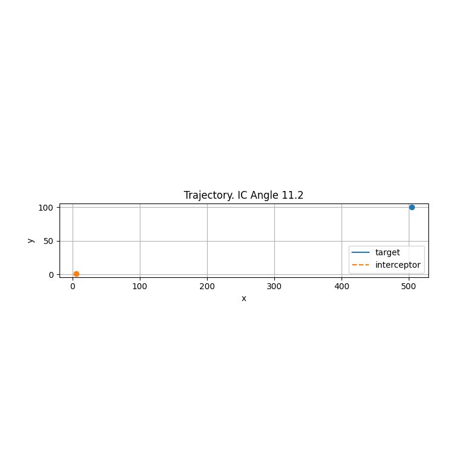

# Guidance
Target interception simple example in 2D. Tested in Python 3.12.4.

# Features
- Two guidance modes:
    - PurePursuit – points directly at the target’s line of sight (LOS).
    - PropNav – classical proportional navigation using LOS rate and a navigation gain.
    - PropNavWoSpeed – PropNav for cases we don't know our speed and closing speed. Usually works, but sometimes fails.
- Two example target missions with simple heading profiles.
- Real-time GUI animation (Qt5Agg) and optional GIF recording to ./output/trajectory.gif.
- YAML-based configuration for quick experimentation.

# Project Structure
```bash
├── main.py
├── settings.yaml
├── src/
│   ├── guidance.py        # Guidance base + PurePursuit + PropNav + PropNavWoSpeed + factory
│   ├── missions.py        # TargetMission base + example missions + factory
│   ├── simulation.py      # Simulation loop, GUI, GIF writer, hit detection
│   ├── units.py           # Unit class (constant speed, heading update)
│   └── utils.py           # YAML loader, degree-wrapping helper
└── output/
    └── trajectory.gif     # Created at runtime
```

# Installation
```bash
# 1) Create and activate a virtual environment
python -m venv .venv
# Windows
.venv\Scripts\activate
# Linux/macOS
source .venv/bin/activate

# 2) Upgrade pip and install dependencies
python -m pip install --upgrade pip
pip install -r requirements.txt
```

# Running
Edit settings.yaml as needed, then:
```bash
python main.py
```
A window titled Trajectory will open and animate both agents. A GIF will be saved to ./output/trajectory.gif if the writer is active.

# Settings
```yaml
guidance: "prop_nav"                 # "prop_nav" or "pure_pursuit" or "prop_nav_wo_speed"
mission: "BallisticAttackFromRight"  # "BallisticAttackFromRight" or "Pursuit"
simulation:
  target_fps: 10                  # GUI + capture FPS
  sim_n_steps: 300                # max steps before stopping
  blast_radius: 4                 # hit threshold (units)
target:
  start_x: 500
  start_y: 100
  speed: 4
interceptor:
  start_x: 0
  start_y: 0
  speed: 2.5
```
**Notes**
- Units: Positions are in arbitrary units; `speed` is units per simulation step.
- Blast radius: An interception is declared if the distance between target and interceptor becomes < `blast_radius` at any step.
- FPS & time: The loop aims to run at `target_fps`. With the current Unit.update, higher FPS means more (smaller) steps; speed is per step.

# Example
Side interception with interceptor slower than target:  

  
Pursuit with interceptor faster than target:  


